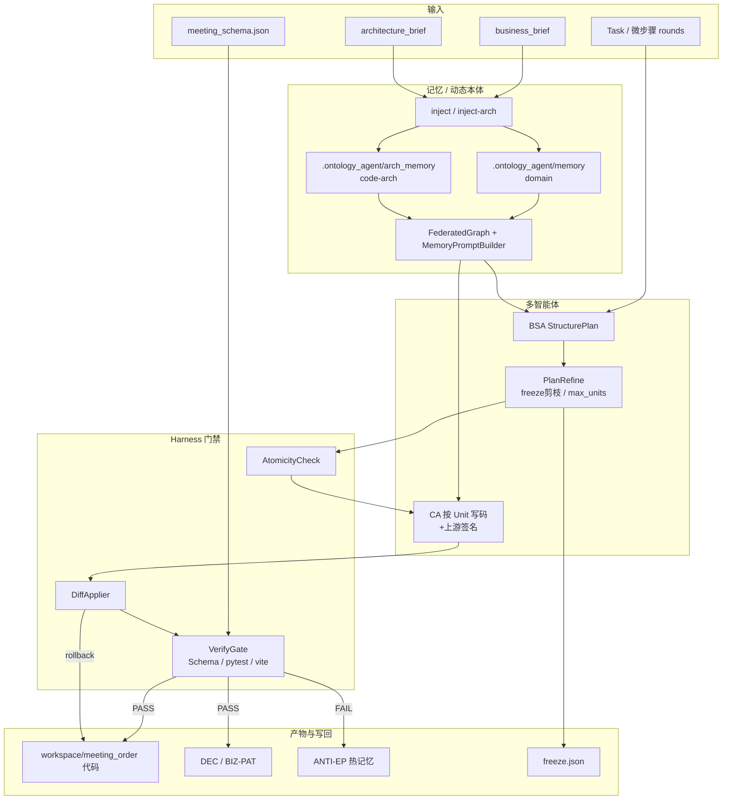

# ifclubdemo

**端侧小模型业务软件编码系统**：用 **小模型（默认 ~30B）+ 动态本体 + 多智能体（BSA/CA + Harness）**，在本地/端侧编写带 **前端、后端与业务逻辑** 的业务应用。

不是「单 Agent 一把梭写完」，也不是「本体概念讲义」。核心目标是：在本体约束与确定性门禁下，让小模型稳定产出可运行的全栈业务软件。

主线示例为 **会议室预订系统（meeting_order）**：Python(FastAPI) 后端 + React 前端 + 领域规则（SQLite），全程由 `qwen3-coder-30b-a3b-instruct`（<50B 档）经 CLI/EP 生成。

默认模型：云端 `qwen3-coder-30b-a3b-instruct`（<50B 档，云端模拟端侧）。

> 已验证：2 会话 × 30 轮（共 60 轮）纯白话意图构建 meeting_order，全程 30B；Session A 0 repair、Session B 仅 2 repair 通过；最终 `pytest` + `vite build` + `cli verify` 全绿。详见下文「构建实验」。

---

## 架构总览

三层叠在一起：

1. **动态本体 / Schema**：业务规矩与工程约定先变成可注入、可校验的记忆与硬契约（约束「写什么、怎么验收」）
2. **多智能体 + Harness**：BSA 规划 → CA 按 Unit 写码 → 确定性门禁验收（落盘白名单、Schema、编译、pytest/vite）
3. **记忆写回**：成功沉淀 DEC/PAT，失败沉淀 ANTI；跨 EP / 跨 Session 复用，让后续生成更稳

小模型场景靠的是 **窄任务 + 硬契约 + 分层门禁**，而不是更长 prompt。

### 1) 包内代码架构（工具侧）

```text
ifclubdemo/
├── cli.py / cli_support/          # 入口：init-app / inject / inject-arch / run / verify
├── agents/                        # 有 LLM 的 Agent
│   ├── business_structure_agent.py   # BSA：产出 StructurePlan（多 Unit）
│   ├── coding_agent.py               # CA：按 Unit 生成完整文件
│   ├── structure_plan.py             # Plan / Unit 契约
│   └── code_context.py               # 签名摘要（供 CA 对齐上游）
├── harness/                       # 零 LLM 的确定性控制面
│   ├── ep_coordinator.py          # EP 状态机：锚定→计划→执行→校验→写回
│   ├── atomicity_check.py         # 路径白名单 / 禁路径 / freeze
│   ├── plan_refine.py             # freeze 剪枝 + Unit 预算（≤N 文件）
│   ├── diff_applier.py            # 落盘 / 备份 / 回滚 / scratch
│   ├── verify_gate.py             # CodeValidator + Schema + compile + pytest/vite
│   ├── schema_gate.py             # meeting_schema.json 硬校验
│   ├── freeze_state.py            # models 等稳定点冻结
│   ├── ep_promotion.py            # PASS→DEC/PAT；FAIL→ANTI
│   └── session_flush.py           # 会话归档（不进共享本体）
├── memory_*.py / federated_graph.py / ontology_registry.py
│                                  # 记忆加载、注入、GC、联邦检索
├── ep_queue.py                    # 多 EP 串行队列（2-session 重建用）
├── docs/
│   ├── business_brief.md 模板源    # → scaffold → inject → domain 记忆
│   ├── architecture_brief.md      # → inject-arch → code-arch 记忆
│   └── meeting_schema.json         # 领域 Object硬 Schema
├── instances/                     # 未 inject-arch 时的架构种子
├── schema/objects/*.yaml          # 记忆 ObjectType（Constraint/Pattern/Anti/Decision）
└── scripts/run_meeting_60r_30b.py  # 2×30 轮白话构建实验
```


### 2) 技术分层（运行时）




| 层                      | 职责                                         | 是否调 LLM |
| ---------------------- | ------------------------------------------ | ------- |
| 记忆注入                   | brief → Constraint / Pattern / AntiPattern | 否       |
| BSA                    | 拆 StructurePlan（文件级 Unit）                  | 是       |
| PlanRefine / Atomicity | freeze 剔除、Unit 预算、禁路径                      | 否       |
| CA                     | 单文件完整源码                                    | 是       |
| DiffApplier            | 白名单落盘、失败回滚、scratch                         | 否       |
| VerifyGate             | SchemaGate + compile + 分层 pytest/vite      | 否       |
| Promotion              | PASS→共享 DEC/PAT；FAIL→ANTI hot              | 否       |


### 3) 目标产物分层（meeting_order：Agent 要生成的业务软件）

主线产出不是文档或演示稿，而是一套可运行的业务软件骨架：

```text
workspace/meeting_order/
├── docs/meeting_schema.json        # 硬契约（与工具 SchemaGate 共用）
├── backend/src/meeting_order/
│   ├── models/                      # Room / Booking（可 freeze）
│   ├── schemas/                     # DTO：CreateBookingRequest 等
│   ├── domain/rules.py              # 纯函数校验（无 I/O）
│   ├── repositories/                # 仓储抽象；sqlite / mysql 可切换
│   ├── services/                    # 服务层编排 domain + repositories
│   ├── api/*.py                     # 路由层：HTTP ↔ DTO ↔ Service
│   ├── config.py                    # MEETING_DB_BACKEND 等
│   └── main.py                      # lifespan → init_db；挂载 /api/v1
├── frontend/src/                    # React；页面/组件白名单；禁止 @/
└── tests/meeting_order/             # conftest monkeypatch DB → sqlite tmp
```

约定：

- **依赖方向**：`api → services → (domain | repositories) → models`  
- **业务规则**只在 `domain/`；**编排**在 `services/`；**持久化**只经 `repositories`  
- **前端**只展示结果，不重算冲突；样式用 `styles.css` CSS 变量  
- **models 通过后 freeze**，后续 EP 只读签名、改下游  
- **门禁分层**：domain/api/services → scoped pytest；frontend → `vite build`  
- **微步骤**：Impl / Test / Repair 分轮，默认每轮 ≤2 Unit（冻结后实现轮优先 1）


### 4) 双域记忆与硬契约（本体如何约束编码）

```text
业务记忆 domain     ← business_brief（业务对象、规则、反模式）
架构记忆 code-arch  ← architecture_brief（分层、写范围、门禁、freeze）
硬 Schema           ← meeting_schema.json（字段白/黑名单，机器校验）
运行时写回          ← DEC/PAT（成功）+ ANTI-EP（失败，gc-protect）
会话归档            ← .ontology_agent/sessions/<id>/（不进共享本体）
```

**本体在这里不是资料库，而是编码运行时的约束层**：先规定 Agent 能改什么、业务规则落在哪一层、怎样算验收通过，再让小模型写前后端与领域逻辑。

小模型场景应预置哪些种子记忆，见 [docs/SEED_MEMORY_FOR_SMALL_MODEL.md](docs/SEED_MEMORY_FOR_SMALL_MODEL.md)。

---


## 0. 一次性准备

```bash
cd democode/ifclubdemo

# 1) 配置环境（若尚无 .env）
cp .env.example .env
# 编辑 .env：填入 LLM_API_KEY；确认工作区路径
```

`.env` 关键项：


| 变量                 | 含义          | 默认                             |
| ------------------ | ----------- | ------------------------------ |
| `LLM_API_KEY`      | 大模型 API Key | （必填）                           |
| `LLM_BASE_URL`     | API 地址      | DashScope 兼容接口                 |
| `LLM_MODEL`        | 模型名         | `qwen3-coder-30b-a3b-instruct` |
| `IFCLUB_WORKSPACE` | 工作区根目录      | `./workspace`                  |
| `IFCLUB_APP`       | 默认应用名       | `meeting_order`                |


默认应用路径：`democode/ifclubdemo/workspace/meeting_order`。

```bash
# 2) 依赖（可选）
pip install -r requirements.txt

# 3) 自检
python3 cli.py doctor
# 或
bash scripts/demo_doctor.sh
```

`doctor` 应显示：`.env` 存在、`API key: yes`、`WORKSPACE` 指向 `.../ifclubdemo/workspace`。

---


## 1. Step-by-step：从业务记忆到测试通过

以下以 **会议室预订系统（meeting_order）** 为例。  
除非注明，命令均在 `democode/ifclubdemo` 目录执行；`--workspace` 可省略（读 `.env`）。

### Step 1 — 构建脚手架（含业务 / 架构说明模板）

```bash
python3 cli.py init-app meeting_order
```

生成：

```text
workspace/meeting_order/
├── docs/business_brief.md          # ★ 业务说明 → inject
├── docs/architecture_brief.md      # ★ 架构说明 → inject-arch
├── acceptance/checklist.md
├── backend/ ...                    # FastAPI 骨架
├── frontend/ ...                   # React + Vite 骨架
├── tests/meeting_order/
├── .ontology_agent/memory/         # 业务记忆落盘
├── .ontology_agent/arch_memory/    # 架构记忆落盘（inject-arch 后）
└── workspace.toml
```

两条初始记忆路径：

```text
业务：docs/business_brief.md  → inject       → .ontology_agent/memory/     → 域 domain
架构：docs/architecture_brief.md → inject-arch → .ontology_agent/arch_memory/ → 域 code-arch
      （未 inject-arch 时回退包内 ifclubdemo/instances/）
```

> meeting_order 的一键构建脚本：`scripts/run_meeting_60r_30b.py`（2×30 轮白话构建，全程 30B）。

---


### Step 2 — 编写 / 确认业务说明（业务记忆的源头）

编辑：

```bash
$EDITOR workspace/meeting_order/docs/business_brief.md
```

重点维护这些章节（会被 `inject` 解析）：

- **硬约束**：同房间同一时间段不可重叠预订、房间容量与生效状态等  
- **推荐模式**：冲突返回明确错误码（409）、前端展示后端错误（不重算规则）  
- **反模式**：预订规则写在 API 层、忽略冲突继续保存、硬约束只写在前端等

工程约定（API 前缀、Vite proxy、前端不直连 SQLite、写范围含 `backend/`）放在  
`docs/architecture_brief.md`，用 `inject-arch`，不要写进业务说明。

说明文档：[docs/BUSINESS_MEMORY.md](docs/BUSINESS_MEMORY.md)

---


### Step 3 — 注入业务记忆（Domain Memory）

预览（不写盘）：

```bash
python3 cli.py inject docs/business_brief.md --dry-run
```

正式写入：

```bash
python3 cli.py inject docs/business_brief.md
```

**业务记忆落盘位置（容易漏看）：**

```text
workspace/meeting_order/.ontology_agent/memory/
├── CROSS_CUTTING/CN-MEETING_ORDER-*.md   # ConstraintMemory
├── DOMAIN/PAT-MEETING_ORDER-*.md         # PatternMemory
└── DOMAIN/ANTI-MEETING_ORDER-*.md        # AntiPatternMemory

workspace/meeting_order/.ontology_agent/inject_report.json   # 审计报告
```

列出业务记忆 + 架构记忆：

```bash
python3 cli.py memory list
```

---


### Step 4 — 注入 / 确认架构记忆（code-arch）

编辑架构说明（可选，脚手架已带模板）：

```bash
$EDITOR workspace/meeting_order/docs/architecture_brief.md
```

典型内容：**分层**、API 前缀 / Vite proxy、前端不直连库、**写路径可回滚**、**写范围**（含 `backend/`）。

写入工作区 `arch_memory`（有则优先于包内种子）：

```bash
python3 cli.py inject-arch docs/architecture_brief.md --dry-run
python3 cli.py inject-arch docs/architecture_brief.md
python3 cli.py memory list
```

落盘位置：

```text
workspace/meeting_order/.ontology_agent/arch_memory/
├── CROSS_CUTTING/CN-ARCH-WS-*.md
└── DOMAIN/ANTI-ARCH-WS-*.md

workspace/meeting_order/.ontology_agent/inject_arch_report.json
```

未执行 `inject-arch` 时，EP 使用包内精简种子 `ifclubdemo/instances/`。

说明：[docs/ARCHITECTURE_MEMORY.md](docs/ARCHITECTURE_MEMORY.md)

`run` / `fix` 时会 **联邦注入**：`code-arch`（架构）+ `domain`（业务）→ Agent Manifest。  
子目录名 `DOMAIN/` / `CROSS_CUTTING/` 是本体分层，不是「业务 vs 架构」——后者看 `memory/` vs `arch_memory/`。

---


### Step 5 — 用 CLI 编写代码（首次构建）

按验收清单驱动一轮 EP（需要有效 `LLM_API_KEY`）：

```bash
python3 cli.py run --task-file acceptance/checklist.md
```

或自然语言：

```bash
python3 cli.py run --task "实现 domain/rules 冲突检测：同房间同一时间段不可重叠预订，并补 API 与单测"
```

离线看 Harness 流程（stub，不调模型）：

```bash
bash scripts/demo_harness_stub.sh
# 或
python3 cli.py run --task "修复 Kafka 幂等" --no-llm --no-apply
```

成功时会：

1. BSA 出多模块 `StructurePlan`
2. CA 按 Unit 生成代码
3. `DiffApplier` 写入 `workspace/meeting_order/...`
4. `VerifyGate` 跑约束 + `compileall` + `pytest`
5. 通过则写回 DecisionRecord（记忆晋升）

---


### Step 6 — 执行测试

```bash
python3 cli.py verify
```

等价于：对当前应用做 `compileall` + `pytest`（路径来自 `workspace.toml` 的 `test_cmd`）。

仅测后端也可：

```bash
cd workspace/meeting_order
PYTHONPATH=backend/src pytest -q tests/meeting_order
```

---


### Step 7 — 修改 Bug（增量修复）

验证失败后：

```bash
# 自动带上最近一次 verify 错误摘要
python3 cli.py fix --from-verify

# 或明确描述 + 限定文件（推荐）
python3 cli.py fix \
  --task "修复：同房间同一时间段重叠预订未被拒绝，应返回 409" \
  --files backend/src/meeting_order/domain/rules.py,tests/meeting_order/test_rules.py
```

再验证：

```bash
python3 cli.py verify
```

`fix` 与 `run` 的区别：


|      | `run`     | `fix`             |
| ---- | --------- | ----------------- |
| 场景   | 首次构建、大块功能 | 已有代码上修缺陷          |
| 上下文  | 任务 + 记忆   | 任务 + 记忆 + 现有文件/错误 |
| 改动范围 | 可新建多文件    | 更宜 `--files` 收窄   |


回滚某次落盘（备份在 `.ontology_agent/backup/<ep_id>/`）：可手工从备份恢复，或后续使用 rollback 能力。

---


### Step 8 — 修改实现逻辑（业务规则变更）

正确顺序：**先改记忆，再改代码**。

```bash
# 1) 改业务说明（例如：预订最小时长调整为 30 分钟）
$EDITOR workspace/meeting_order/docs/business_brief.md

# 2) 重新注入业务记忆
python3 cli.py inject docs/business_brief.md
python3 cli.py memory list

# 3) 让 Agent 按新约束改实现与测试
python3 cli.py fix --task "按最新 ConstraintMemory 调整预订时长约束，并更新单测"

# 4) 回归
python3 cli.py verify
```

---


### Step 9 — 生成 / 补强测试用例

```bash
python3 cli.py run --task "为 domain/rules 补充 pytest：覆盖同房间时间冲突、跨房间不冲突、房间容量校验"

# 或定点
python3 cli.py fix \
  --task "补充 test_rules 中同房间时间冲突用例" \
  --files tests/meeting_order/test_rules.py
```

然后：

```bash
python3 cli.py verify
```

---


### Step 10 —（可选）跑起来看一眼

```bash
# 后端
cd workspace/meeting_order/backend
PYTHONPATH=src uvicorn meeting_order.main:app --reload --port 8000

# 前端（另开终端）
cd workspace/meeting_order/frontend
npm install
npm run dev
```

浏览器打开 Vite 提示的地址；API 经 proxy 访问 `/api/v1`。

---


## 2. 命令速查


| 命令                       | 作用                                                    |
| ------------------------ | ----------------------------------------------------- |
| `doctor`                 | 检查 `.env`、LLM、工作区、依赖                                  |
| `init`                   | 初始化通用 workspace                                       |
| `init-app [meeting_order]` | 生成 FastAPI+React 脚手架 + 业务/架构说明模板                      |
| `inject <brief.md>`      | 业务说明 → `.ontology_agent/memory/`（支持 `--dry-run`）      |
| `inject-arch <brief.md>` | 架构说明 → `.ontology_agent/arch_memory/`（支持 `--dry-run`） |
| `memory list`            | 列出业务记忆 + 架构记忆（工作区优先）                                  |
| `run`                    | 单次 EP：规划 → 编码 → 落盘 → 校验                               |
| `fix`                    | 增量修复（`--from-verify` / `--files`）                     |
| `verify`                 | compileall + pytest                                   |


通用参数：

- `--workspace`：覆盖 `.env` 默认应用目录  
- `--no-llm`：强制 stub  
- `--no-apply`：只演练不落盘

---


## 3. 演示 / 构建脚本（scripts/）


| 脚本                                 | 内容                             |
| ---------------------------------- | ------------------------------ |
| `scripts/demo_doctor.sh`           | 环境自检                           |
| `scripts/demo_harness_stub.sh`     | 无 LLM 跑通 Harness               |
| `scripts/run_meeting_60r_30b.py`   | meeting_order：2×30 轮白话构建（全程 30B） |
| `scripts/run_meeting_sessions_30b.py` | meeting_order：2×10 轮构建（30B） |
| `scripts/final_repair_30b.py`      | 末轮全量 30B 修复循环 |


```bash
chmod +x scripts/*.sh
bash scripts/demo_doctor.sh
```

---


## 4. 目录结构（开发聚焦）

```text
ifclubdemo/
├── .env / .env.example      # LLM + WORKSPACE（.env 已 gitignore，.env.example 是模板）
├── .gitignore               # 忽略 workspace/legacy/logs/缓存/密钥/构建产物
├── cli.py                   # 统一入口
├── docs/
│   ├── BUSINESS_MEMORY.md / ARCHITECTURE_MEMORY.md
│   ├── architecture_brief.md / meeting_schema.json
│   └── SEED_MEMORY_FOR_SMALL_MODEL.md
├── scripts/                 # 构建/演示脚本（run_meeting_60r_30b.py 等）
├── agents/ harness/         # BSA/CA + EP 编排
├── instances/               # 架构记忆精简种子（未 inject-arch 时回退）
├── schema/                 # 记忆本体 schema
└── workspace/              # 默认工作区（gitignore，运行时产物）
    └── meeting_order/       # 主线产物：前后端 + 业务逻辑
        ├── docs/{business,architecture}_brief.md
        └── .ontology_agent/
            ├── memory/          # 业务记忆（inject）
            └── arch_memory/     # 架构记忆（inject-arch）
```

> `legacy/`（旧演示归档）与 `logs/`（构建日志）均为运行时产物，已在 `.gitignore` 中忽略，不会进入仓库。

---

---


## 6. 常见问题

**Q: inject 之后记忆在哪？**  
A: `workspace/meeting_order/.ontology_agent/memory/`，用 `python cli.py memory list` 查看。详见 [docs/BUSINESS_MEMORY.md](docs/BUSINESS_MEMORY.md)。

**Q: 为什么 doctor 说没有 API key？**  
A: 确认 `ifclubdemo/.env` 存在且含 `LLM_API_KEY=`（不要只改 `.env.example`）。

**Q: 如何换工作区路径？**  
A: 改 `.env` 里 `IFCLUB_WORKSPACE` / `IFCLUB_APP`，或命令行传 `--workspace`。

---

## 7. 构建实验：60 轮白话构建（全程 30B）

`scripts/run_meeting_60r_30b.py` 用 **2 会话 × 30 轮纯白话意图**构建 meeting_order，全程 `qwen3-coder-30b-a3b-instruct`，复用本项目的工程手段（契约/种子/脚手架/repair/distill）。

```bash
# 干净重建（会重置 workspace/meeting_order）
python3 scripts/run_meeting_60r_30b.py

# 断点续跑（保留 workspace，跳过已过轮次）
SKIP_RESET=1 START_FROM_LABEL=B25-seed-summary python3 scripts/run_meeting_60r_30b.py
```

**最近一次结果**：Session A 30 轮 0-repair 通过；Session B 30 轮通过（仅 2 次 repair）；最终 `pytest` 26 passed、`vite build` 成功、`cli.py verify` 通过。

**关键工程手段（兜底 30B 的跨文件漂移）**：

- 种子记忆注入：30 条域记忆 + 11 条架构记忆（含 `list_bookings(room_id=None)`、禁 `except Exception` 兜底、禁 patch 路由函数 mock 等）。
- VerifyGate 静态契约：`SYMBOL-FORBIDDEN`、`SEED-SIGNATURE`、`TEST-URL-PREFIX`（已精确化，区分 API 调用与源码断言）、`FACTORY-NO-CACHE`、`IMPORT-RESOLVE`。
- CodingAgent 生成后守卫：路径/符号/命名/长度检查（已对 `.md` 文档豁免，避免散文误判）。
- 失败即时蒸馏：`distill_failure_to_memory` → ANTI + Constraint，重复指纹 loop-guard 加强。
- 末轮全量 pytest + 最终修复：`scripts/final_repair_30b.py`。

**经验沉淀**：30B 的跨文件签名/异常一致性是薄弱环节，种子记忆是强先验但仍会被漂移覆盖，需「静态契约 + 末轮全量校验」兜底；静态契约必须区分「代码语义」与「文本出现」，否则会在 docs/test-assertion 场景误伤。详见 `workspace/meeting_order/docs/round60_findings_and_seeds.md`（运行后生成）。

---

## 8. 安全与提交约定

- `.env`（含 `LLM_API_KEY` 等真实密钥）已在 `.gitignore`，**绝不提交**；只提交 `.env.example` 模板。
- `workspace/`（生成的应用、SQLite 数据库、`.ontology_agent` 记忆落盘/备份/scratch/sessions）、`legacy/`（旧产物归档）、`logs/`、`__pycache__/`、`node_modules/`、`dist/`、`*.db` 等运行时/生成物均已忽略。
- 源码中无硬编码密钥（已检索 `sk-*` / `API_KEY=` / `secret=` / `password=` 等模式，无命中）。
- 提交前可用 `git status` 与 `git diff --cached` 复核；如需确认某文件是否被忽略：`git check-ignore -v <path>`。